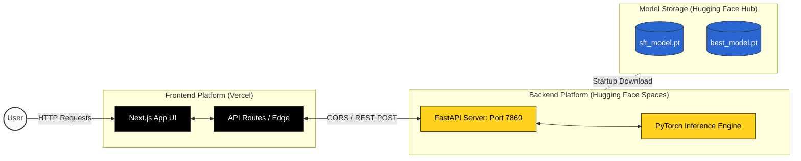
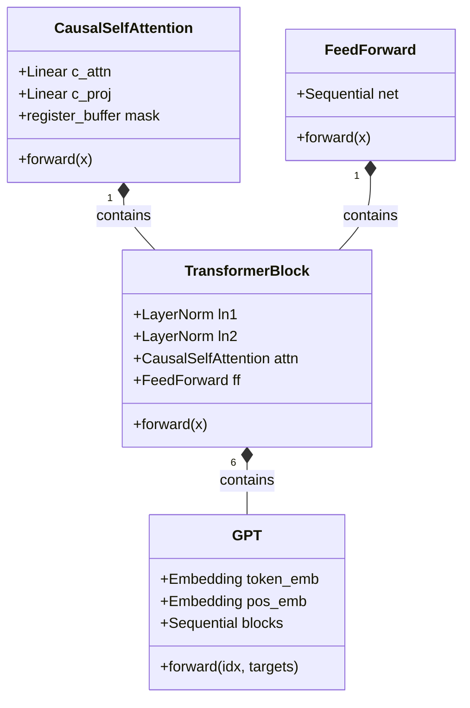

<div align="center">

# 🧠 NanoMind AI

### A 30M Parameter GPT Architecture Built From Scratch

[](https://python.org)
[](https://pytorch.org)
[](https://fastapi.tiangolo.com)
[](https://nextjs.org)
[](https://huggingface.co)
[](https://vercel.com)

*Transformer architecture built from scratch · Pretrained on TinyStories · Finetuned on Alpaca*

[**🌍 View Live Demo**](https://nanomind.vercel.app/) • [**📦 Model Weights**](https://huggingface.co/aryan012234/nanomind-30m) • [**⚙️ API Space**](https://huggingface.co/spaces/aryan012234/nanomind-api)

</div>

---

## 🎯 Project Overview

NanoMind AI is a complete end-to-end Large Language Model project. Rather than fine-tuning an existing architecture like Llama or wrapping an external API, this project implements a complete transformer decoder architecture in raw PyTorch (`nn.Linear`, `nn.LayerNorm`, etc.).

The system encompasses the entire ML lifecycle:
1. **Architecture Design**: Custom GPT decoder implementation
2. **Pretraining**: Unsupervised learning on TinyStories (50M tokens)
3. **Fine-Tuning**: Supervised Fine-Tuning (SFT) on the Alpaca dataset
4. **API Development**: High-performance FastAPI backend
5. **UI & Deployment**: Next.js frontend integrated with Hugging Face cloud infrastructure

---

## 🏗️ System Architecture

The following diagram illustrates the deployment and data flow architecture of the NanoMind AI platform:



---

## 🧠 Model Internals

### Architecture Details
The model follows a classic GPT (decoder-only) architecture with 29.9M parameters.



| Parameter | Value | Description |
|---|---|---|
| **Parameters** | 29.9M | Total learnable weights |
| **Layers (L)** | 6 | Transformer blocks |
| **Heads (H)** | 6 | Multi-head attention heads |
| **Embedding (D)** | 384 | Embedding dimension |
| **Context Size** | 128 | Maximum sequence length |
| **Vocabulary** | 50,257| GPT-2 BPE via TikToken |
| **Weight Tying**| Yes | Input/Output embeddings tied |

---

## ☁️ Deployment Guide

NanoMind AI uses a split-infrastructure deployment strategy to maximize performance and minimize cost, separating static front-end serving from heavy GPU/CPU inference.

### 1. Model Weights (Hugging Face Model Hub)
The compiled PyTorch weights are hosted on the Hugging Face Model Hub.
- Upload via `huggingface-cli` or via interface.
- Models are ignored in `.gitignore` to prevent repository bloat.

### 2. API Server (Hugging Face Spaces)
The FastAPI server is deployed as a Docker Space on Hugging Face.
- Listens on `0.0.0.0:7860`.
- Automatically downloads `.pt` files from the Model Hub via the `HF_REPO_ID` environment variable upon container startup.
- Exposes `POST /generate` and `POST /chat` endpoints.

### 3. Frontend Web App (Vercel)
The Next.js user interface is deployed on Vercel's Edge Network for global low latency.
- Connects to the backend via the `NEXT_PUBLIC_API_URL` environment variable.
- Fully responsive, glassmorphism-inspired UI with cinematic text animations.

---

## 💻 Local Development Setup

If you prefer to run the entire stack locally for testing or development:

### 1. Requirements
Ensure you have Python 3.10+ and Node.js 18+ installed.

### 2. Install Dependencies
```bash
# Terminal 1: Setup Backend
cd backend
pip install -r requirements.txt

# Terminal 2: Setup Frontend
cd frontend
npm install
```

### 3. Fetch Models
Place your `sft_model.pt` and `best_model.pt` weights directly into the `models/` directory at the project root.

### 4. Start Servers
```bash
# Terminal 1: Start PyTorch API
cd backend
uvicorn main:app --reload --port 8000

# Terminal 2: Start Next.js App
cd frontend
npm run dev
```

Your API is now available at `http://localhost:8000` and the UI at `http://localhost:3000`.

---

## ⚡ API Specification

The backend server provides a RESTful interface for direct model communication.

**1. Text Generation (`POST /generate`)**  
Used for free-form autocompletion and story generation.
```json
// Request Body
{
  "prompt": "The little dog found a mysterious door and",
  "max_tokens": 150,
  "temperature": 0.85
}
```

**2. Instruction Following (`POST /chat`)**  
Used for the Alpaca SFT conversational format.
```json
// Request Body
{
  "instruction": "Write a short story about a brave cat",
  "input_text": "",
  "max_tokens": 150,
  "temperature": 0.85
}
```

---

<div align="center">
<i>Every weight in this model was initialized randomly and learned entirely from data.</i>
</div>
